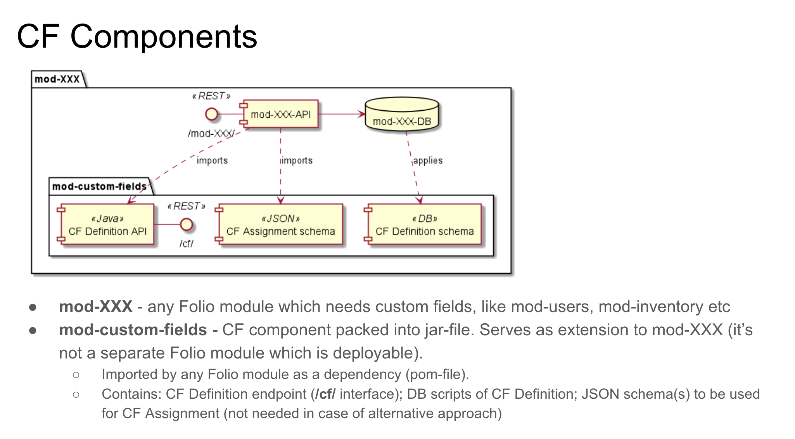

# mod-custom-fields

Copyright (C) 2019 The Open Library Foundation

This software is distributed under the terms of the Apache License,
Version 2.0. See the file "[LICENSE](LICENSE)" for more information.

<!-- ../../okapi/doc/md2toc -l 2 -h 4 README.md -->
* [Introduction](#introduction)
* [Module Deployment](#module-deployment)
* [Issue tracker](#issue-tracker)
* [Code analysis](#code-analysis)

## Introduction

FOLIO module to store and maintain custom fields.

The custom fields module implements a simple CRUD interface POST/PUT/GET/DELETE on /custom-fields and /custom-fields/$id. See the ramls/custom-fields.json for precise definitions.

Written in Java, using the raml-module-builder and uses Maven as its build system.

The general design of the custom fields is following

The module has a common interface which can be used by several modules. 
To define a particular module to calling to, define `X-Okapi-Module-Id` header, detailed information are able via the link to [Okapi documentation](https://github.com/folio-org/okapi/blob/master/doc/guide.md#multiple-interfaces).

## Module Deployment

The custom fields module can be added to any module by following steps:
  1. Add maven dependency for `mod-custom-fields` in project pom file.
  Example:
   ~~~~
    <dependency>
          <groupId>org.folio</groupId>
          <artifactId>mod-custom-fields</artifactId>
          <version>0.0.1-SNAPSHOT</version>
        </dependency>
   ~~~~
  2. Modify the section `scripts` in schema.json file to include `create_custom_fields_table.sql`, which will created a table for storing module-specific custom fields and additional triggers.
  Example:
  ~~~~
  "scripts" : [
      {
        "run": "after",
        "snippetPath": "create_custom_fields_table.sql",
        "fromModuleVersion": "1.0"
      }
    ]
  ~~~~
  3. Modify the ModuleDescriptor.json file by including the custom-fields interface
  Example:   
  ~~~~
  {
    "id": "custom-fields",
    "version": "1.0",
    "interfaceType" : "multiple",
    "handlers": [
      {
        "methods": ["GET"],
        "pathPattern": "/custom-fields",
        "permissionsRequired": ["custom.fields.collection.get"]
      },
      {
        "methods": ["POST"],
        "pathPattern": "/custom-fields",
        "permissionsRequired": ["custom.fields.item.post"]
      },
      {
        "methods": ["GET"],
        "pathPattern": "/custom-fields/{id}",
        "permissionsRequired": ["custom.fields.item.get"]
      },
      {
        "methods": ["PUT"],
        "pathPattern": "/custom-fields/{id}",
        "permissionsRequired": ["custom.fields.item.put"]
      },
      {
        "methods": ["DELETE"],
        "pathPattern": "/custom-fields/{id}",
        "permissionsRequired": ["custom.fields.item.delete"]
      }
    ]
   }
   ~~~~ 
  The permission name inside of the `permissionsRequired` section can be modified to represent the module purpose.
  See [mod-users](https://github.com/folio-org/mod-users/pull/136/files) as an example of `mod-custom-fields` integration.
 
## Issue tracker

See project [MODCFIELDS](https://issues.folio.org/browse/MODCFIELDS)
at the [FOLIO issue tracker](https://dev.folio.org/guidelines/issue-tracker/).

## Code analysis
[SonarQube analysis](https://sonarcloud.io/dashboard?id=org.folio%3Amod-custom-fields).
